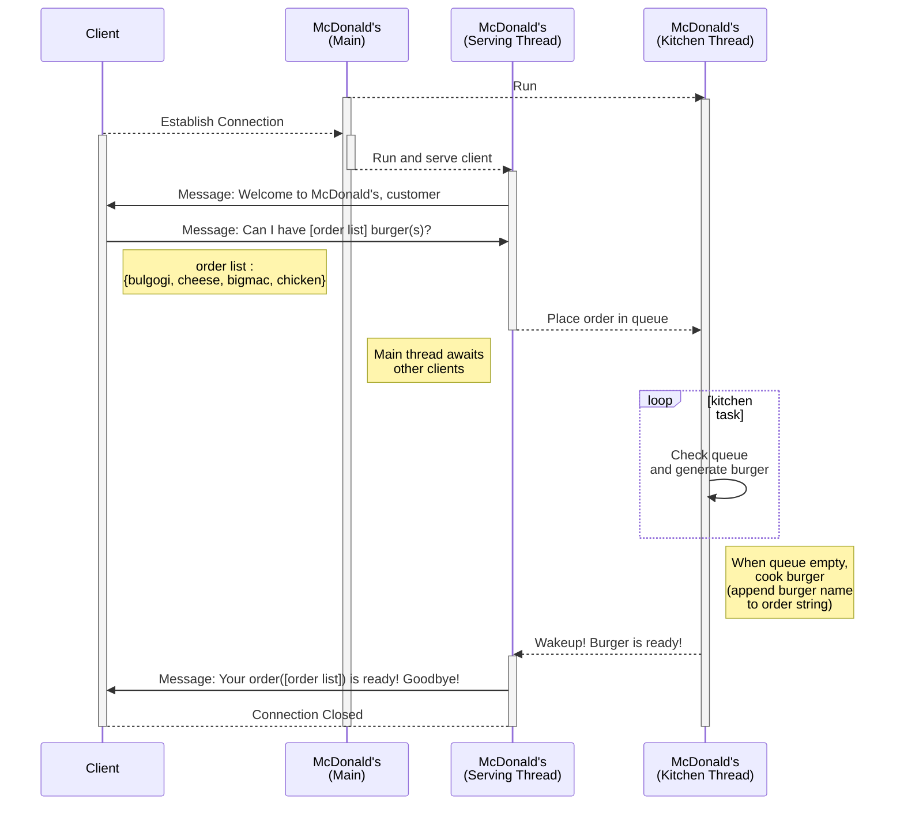

# Lab 5: Network Lab

The purpose of this lab is to familiarize ourselves with networking and the client-server programming model.

To achieve that goal, we implement a server that serves hamburgers and a client that requests them.

You will learn
   * how to communicate under TCP/IP network environment.
   * how to assure atomicity on critical sections between threads.
   * how to limit the number of the clients on listening socket.

## Important Dates

The submission deadline is originally set for 6/17 at 23:59. However, this lab has a shorter execution period compared to others. Therefore, we'll accept submissions with no late penalty until 6/20 at 23:59. After this extended deadline, **late submissions are only accepted until 6/21 at 23:59(20%p dedection). No submission allowed afterwards.**


| Date | Description |
|:---  |:--- |
| Tuesday, June 4, 18:30 | Network Lab Hand-out |
| **Thursday, June 13, 11:00** | Network Lab session 1 |
| Monday, June 17, 23:59 | Submission deadline |


## Logistics

### Hand-out

You can **clone this repository** directly on your VM instance or local computer and get to work. If you want to keep your own repository, you should **keep the lab's visibility to private.** Otherwise, others would see your work. Read the instructions here carefully. Then clone the lab to your local computer and get to work. 

**Changing visibility**

After cloning the repository, you should change the push remote URL to your own repository.

1. Create an empty repository that you're going to manage **(again, keep it private)**
2. Copy the url of that repository
3. On your terminal in the cloned directory, type `git remote set-url --push origin <repo_url>`
4. Check with `git remote -v` if the push URL has changed to yours while the fetch URL remains the same (this repo)

### Submission

You should upload your archive file(.tar) containing code (mcdonalds.c and client.c) and report (2024-12345.pdf) via eTL. To make an archive file, follow the example below on your own VM. 
```
$ ls
2024-12345.pdf  Makefile  README.md  reference  src
$ tar -cvf 2024-12345.tar src/client.c src/mcdonalds.c 2024-12345.pdf
src/client.c
src/mcdonalds.c
2024-12345.pdf
$ file 2024-12345.tar
2024-12345.tar: POSIX tar archive (GNU)
```

* With VirtualBox :
```
scp -P 8888 sysprog@localhost:<target_path> <download_path>
# example: scp -P 8888 sysprog@localhost:/home/sysporg/2024_spring_sysprog_Lab5/2024-12345.tar .
```

* With UTM :
```
scp sysprog@<hostname>:<target_path> <download_path>
# example: scp sysprog@192.168.4.4:/home/sysprog/2024_spring_sysprog_Lab5/2024-12345.tar .
```

| parameter | Description |
|:---  |:--- |
| hostname | ip address of VM |
| target_path | absolute path of the file you want to copy (in VM) |
| download_path | (relative) path where a file will be downloaded (in PC) |

You can get your VM's hostname using `hostname -I` command, and the absolute path of a file using `realpath <filename>` command.

#### Report Guideline

Your report should include following contents.

1. Description of your implementation
   1. how to communicate under a TCP/IP network environment.
   2. when and how to assure atomicity between threads.
2. Description of your parallelism optimization strategy and the performance analysis of your implementation against the reference implementation. 


## McDonald's Overview

_mcdonalds_ is a simple socket-based server tool that serves clients. McDonalds server repeatedly listens and accepts clients until a _SIGINT_ signal (Ctrl+C) is received. On exit, it prints out statistics regarding how it worked.

### Socket Interface

```
        Client                         Server
    +-------------+               +-------------+   
    | getaddrinfo |               | getaddrinfo |
    +-------------+               +-------------+
           |                             |
           v                             v
    +-------------+               +-------------+
    |    socket   |               |    socket   |
    +-------------+               +-------------+
           |                             |
           |                             v
           |                      +-------------+
           |                      |     bind    |
           |                      +-------------+
           |                             |
           |                             v
           |                      +-------------+
           |                      |    listen   |
           |                      +-------------+
           |                             |
           v         Connection          v
    +-------------+    request    +-------------+   Await connection
    |   connect   |- - - - - - - >|    accept   |   request from next client (blocking)
    +-------------+               +-------------+
           |                             |
           v                             v
    +-------------+               +-------------+
 /->|     send    |-------------->|     recv    |<-\
 |  +-------------+               +-------------+  |
 |         |                             |         |
 |         v                             v         |
 |  +-------------+               +-------------+  |
 \--|     recv    |-------------->|     send    |--/
    +-------------+               +-------------+
           |                             |
           v                             v
    +-------------+      EOF      +-------------+
    |    close    |- - - - - - - >| recv (fail) |
    +-------------+               +-------------+
                                         |
                                         v
                                  +-------------+
                                  |    close    |
                                  +-------------+
```
## McDonalds Specification

### Operation

0. Before accepting clients, the server initializes kitchen thread(s).
1. Establish a socket and await connection requests from the client.
2. Once a single connection has been initiated, a dedicated thread serves the client. If the number of connections exceeds the max number of customers, then close the connection.
3. Server sends the client a welcome message.
4. Client now requests multiple burgers by sending the burger names to the server. Our McDonalds only supports 4 burgers: bigmac, cheese, chicken, bulgogi.
5. When the server receives the names of the burger from the client, it splits the request into multiple orders. Then the orders are placed in the queue and the server waits. If any of the burgers are not an available type, close the connection.
6. Background kitchen thread(s) repeatedly check the queue and “cook” the burger for 1 second if any item is available in the queue.
7. After all orders of the request are ready, the kitchen thread that made the last ordered burger wakes up the thread that filed the orders.
8. The server is now ready to hand the burgers and say goodbye to the client.
9. Socket connections are closed on both sides.
10. When Ctrl+C (SIGINT) is pressed, kitchen thread(s) will close, and terminate with simple statistics when pressed again.

### Client Request

Each thread of the client sends a single request to the server and waits for the response.  A single request is a sequence of multiple orders, with each order corresponding to a single burger type. 

A request may have identical burger types. For example, the request “bigmac cheese bigmac chicken” is a valid request, which is a request that contains four orders.

Depending on the macro `BURGER_NUM_RAND` in `burger.h`, the number of orders may be fixed or randomly selected. The max number of burgers in a single request is defined as `MAX_BURGERS`.

### Server Operations on a Request

When the server receives a request from a client thread, it should parse the received request and split it into multiple orders. Then, each order should be enqueued to the order queue.
The kitchen thread dequeues a single order from the queue if possible. After dequeuing, it generates the burger type of the order. Here, “generating a burger” is the act of appending the burger name to the order string. 

When the request first arrives at the server, the order string is initialized to an empty string. The order string will then be filled with the burger types of the request by the kitchen threads. The sequence of burger names in the order string may differ from the sequence in the request, but the order string must contain all the burgers in the request. For example, if the request was “bulgogi chicken bulgogi”, the order string “chicken bulgogi bulgogi” is valid, while “bulgogi chicken” is invalid.

When every order in the request is generated, the kitchen thread that made the last burger will wake up the serving thread. Then, the serving thread will send the order string to the client.


### Communication Protocol



### Client Program

Client generates connection request(s) to the server _mcdonalds_. It accepts the number of clients to generate as input. Each thread will request to the server multiple burgers that were randomly chosen. 

```
client [NumThreads]
```

### Output

#### Server
When you first execute the program, you will see:
```
$ ./mcdonalds
@@@@@@@@@@@@@@@@@@@@@@@@@@@@@@@@@@@@@@@@@@@@@@@@@@@@@@@@@@@@@@@@@@@@@@@@@@@@@@@@@
@@@@@@@@@@@@@@@@@(,,,,,,,,,,,@@@@@@@@@@@@@@@@@@@@@@@,,,,,,,,,,,(@@@@@@@@@@@@@@@@@
@@@@@@@@@@@@@@@,,,,,,,,,,,,,,,,,@@@@@@@@@@@@@@@@@,,,,,,,,,,,,,,,,,@@@@@@@@@@@@@@@
@@@@@@@@@@@@@,,,,,,,@@@@@@,,,,,,,@@@@@@@@@@@@@@(,,,,,,@@@@@@@,,,,,,,@@@@@@@@@@@@@
@@@@@@@@@@@@,,,,,,@@@@@@@@@@,,,,,,,@@@@@@@@@@@,,,,,,,@@@@@@@@@*,,,,,,@@@@@@@@@@@@
@@@@@@@@@@.,,,,,,@@@@@@@@@@@@,,,,,,,@@@@@@@@@,,,,,,,@@@@@@@@@@@@,,,,,,/@@@@@@@@@@
@@@@@@@@@,,,,,,,,@@@@@@@@@@@@@,,,,,,,@@@@@@@,,,,,,,@@@@@@@@@@@@@,,,,,,,,@@@@@@@@@
@@@@@@@@,,,,,,,,@@@@@@@@@@@@@@@,,,,,,,@@@@@,,,,,,,@@@@@@@@@@@@@@@,,,,,,,,@@@@@@@@
@@@@@@@@,,,,,,,@@@@@@@@@@@@@@@@,,,,,,,,@@@,,,,,,,,@@@@@@@@@@@@@@@@,,,,,,,@@@@@@@@
@@@@@@@,,,,,,,,@@@@@@@@@@@@@@@@@,,,,,,,,@,,,,,,,,@@@@@@@@@@@@@@@@@,,,,,,,,@@@@@@@
@@@@@@,,,,,,,,@@@@@@@@@@@@@@@@@@,,,,,,,,,,,,,,,,,@@@@@@@@@@@@@@@@@@,,,,,,,,@@@@@@
@@@@@,,,,,,,,,@@@@@@@@@@@@@@@@@@@,,,,,,,,,,,,,,,@@@@@@@@@@@@@@@@@@@,,,,,,,,,@@@@@
@@@@@,,,,,,,,@@@@@@@@@@@@@@@@@@@@,,,,,,,,,,,,,,,@@@@@@@@@@@@@@@@@@@@,,,,,,,,@@@@@
@@@@,,,,,,,,,@@@@@@@@@@@@@@@@@@@@,,,,,,,,,,,,,,@@@@@@@@@@@@@@@@@@@@@,,,,,,,,,@@@@
@@@@,,,,,,,,,@@@@@@@@@@@@@@@@@@@@@,,,,,,,,,,,,,@@@@@@@@@@@@@@@@@@@@@,,,,,,,,,@@@@
@@@,,,,,,,,,@@@@@@@@@@@@@@@@@@@@@@,,,,,,,,,,,,,@@@@@@@@@@@@@@@@@@@@@@,,,,,,,,,@@@
@@@,,,,,,,,,@@@@@@@@@@@@@@@@@@@@@@,,,,,,,,,,,,,@@@@@@@@@@@@@@@@@@@@@@,,,,,,,,,@@@
@@@,,,,,,,,,@@@@@@@@@@@@@@@@@@@@@@@,,,,,,,,,,,@@@@@@@@@@@@@@@@@@@@@@@,,,,,,,,,@@@
@@,,,,,,,,,,@@@@@@@@@@@@@@@@@@@@@@@,,,,,,,,,,,@@@@@@@@@@@@@@@@@@@@@@@,,,,,,,,,,@@
@@,,,,,,,,,,@@@@@@@@@@@@@@@@@@@@@@@,,,,,,,,,,,@@@@@@@@@@@@@@@@@@@@@@@,,,,,,,,,,@@
@@,,,,,,,,,@@@@@@@@@@@@@@@@@@@@@@@@,,,,,,,,,,,@@@@@@@@@@@@@@@@@@@@@@@@,,,,,,,,,@@
@,,,,,,,,,,@@@@@@@@@@@@@@@@@@@@@@@@,,,,,,,,,,,@@@@@@@@@@@@@@@@@@@@@@@@,,,,,,,,,,@
@,,,,,,,,,,@@@@@@@@@@@@@@@@@@@@@@@@,,,,,,,,,,,@@@@@@@@@@@@@@@@@@@@@@@@,,,,,,,,,,@
@,,,,,,,,,,@@@@@@@@@@@@@@@@@@@@@@@@,,,,,,,,,,,@@@@@@@@@@@@@@@@@@@@@@@@,,,,,,,,,,@
@,,,,,,,,,,@@@@@@@@@@@@@@@@@@@@@@@@,,,,,,,,,,@@@@@@@@@@@@@@@@@@@@@@@@@,,,,,,,,,,@
@,,,,,,,,,,@@@@@@@@@@@@@@@@@@@@@@@@,,,,,,,,,,@@@@@@@@@@@@@@@@@@@@@@@@@,,,,,,,,,,@
@,,,,,,,,,,@@@@@@@@@@@@@@@@@@@@@@@@@@@@@@@@@@@@@@@@@@@@@@@@@@@@@@@@@@@,,,,,,,,,,@
@,,,,,,,,,,@@@@@@@@@@@@@@@@@@@@@@@@@@@@@@@@@@@@@@@@@@@@@@@@@@@@@@@@@@@,,,,,,,,,,@

                          I'm lovin it! McDonald's
[Thread 139931498706688] Kitchen thread ready
[Thread 139931490313984] Kitchen thread ready
[Thread 139931481921280] Kitchen thread ready
[Thread 139931473528576] Kitchen thread ready
[Thread 139931465135872] Kitchen thread ready
...
Listening…
```
When the program _client_ is executed:
```
Customer #0 visited
Customer #1 visited
Customer #2 visited
Customer #3 visited
Customer #4 visited
Customer #5 visited
Customer #6 visited
Customer #7 visited
Customer #8 visited
Customer #9 visited
[Thread 139931481921280] generating bigmac burger for customer 0
[Thread 139931498706688] generating cheese burger for customer 0
[Thread 139931490313984] generating chicken burger for customer 0
[Thread 139931473528576] generating bulgogi burger for customer 1
[Thread 139931465135872] generating bigmac burger for customer 3
[Thread 139931481921280] bigmac burger for customer 0 is ready
[Thread 139931481921280] generating bigmac burger for customer 3
[Thread 139931481921280] bigmac burger for customer 3 is ready
[Thread 139931481921280] generating bigmac burger for customer 5
[Thread 139931481921280] bigmac burger for customer 5 is ready
[Thread 139931481921280] generating bulgogi burger for customer 5
[Thread 139931481921280] bulgogi burger for customer 5 is ready
[Thread 139931481921280] all order done for customer 5

...
```
When you want to terminate the program first press Ctrl+C (SIGINT) to terminate all the kitchen threads
```
^C****** I'm tired, closing McDonald's ******
[Thread 139931498706688] terminated
[Thread 139931481921280] terminated
[Thread 139931490313984] terminated
[Thread 139931473528576] terminated
[Thread 139931465135872] terminated
...
```

Now you are ready to close the program. Press Ctrl+C again to terminate the server completely.
```
^C
====== Statistics ======
Number of customers visited: 10
Number of bigmac burger made: 6
Number of cheese burger made: 1
Number of chicken burger made: 3
Number of bulgogi burger made: 10
```

#### Client
```
$ ./client 10
[Thread 140502418732800] From server: Welcome to McDonald's, customer #0
[Thread 140502418732800] Ordering 3 burgers
[Thread 140502305322752] From server: Welcome to McDonald's, customer #1
[Thread 140502305322752] Ordering 1 burgers
[Thread 140502418732800] To server: Can I have bigmac cheese chicken burger(s)?
[Thread 140502305322752] To server: Can I have bulgogi burger(s)?

...

[Thread 140502305322752] From server: Your order(bulgogi) is ready! Goodbye!
[Thread 140502418732800] From server: Your order(bigmac cheese chicken) is ready! Goodbye!

...

```

## Handout Overview

The handout contains the following files and directories

| File/Directory | Description |
|:---  |:--- |
| README.md | this file |
| Makefile | Makefile for compiling mcdonalds and client |
| src/burger.c/h | Macro definitions for socket connection and enum types for burgers |
| src/client.c | Client-side implementation. A skeleton is provided. Implement your solution by editing this file. |
| src/mcdonalds.c | The McDonald's server. A skeleton is provided. Implement your solution by editing this file. |
| src/net.c/h | Network helper functions for the lab |
| reference/ | Reference implementation |


## Your Task
Your task is to implment this lab according to the specification above. The lab is divided in different milestons that should be completed before the deadlines (refer to the schedule above). 

### Step-1 (Multi-threaded server)
The first functionality to implement is the multi-threaded server which accepts multiple clients. The client thread will be in charge of each client we create. The thread is already implemented in client.c as `thread_task()`. One helpful thing to do before connecting to the server and checking if the threads are well started is to print the client number or anything recognizable inside the `thread_task()`. Making sure the threads are working before connecting to the server will simplify the rest of the lab implementation. 

After the thread implementation, implement the socket communication functionality. The skeleton provides some structures, global variables and macros that we think to be helpful. Start by working on `start_server()` in `mcdonalds.c` and `thread_task()` in `client.c`. Make sure that the code on your server and client follows the basic socket connection procedure that you've learned from the lecture. Helper functions in `net.c/h` will help you use socket connection easily. 

Next, we need to make sure that the server works in a multi-threaded way. Your implementation must support multiple clients while having multiple kitchen threads in the background. Beware of critical sections - atomicity must be assured to some shared data structures. 

For debugging purposes, you may change the constant definitions in `burger.h`. However, your implementation must be able to work with arbitrary constant values.

### Step-2 (Parallelism Optimization)
The reference mcdonalds implementation is made by following step-1, meaning that it uses a global mutex(`kitchen_mutex`) shared among every kitchen thread. This becomes a major bottleneck of the reference implementation. Now, devise a strategy to improve the parallelism, and compare the performance difference between your optimized implementation and reference implementation.

Check your performance by timing the client process using `time ./client <n>`. When optimized correctly, your implementation will show a significant performance boost. The reference implementation sets `CUSTOMER_MAX` as 10, `NUM_KITCHEN` as 30, `MAX_BURGERS` as 3, and `BURGER_NUM_RAND` as 0(False).

## Hints

### Lecture Notes & Skeleton code
These two materials may give you some hints about how you can start the lab.

### C library calls

To give you some insight, we provide a list of C library calls that you might find helpful to solve this lab. Read the man pages carefully to learn how exactly the functions operate.

<table>
  <thead>
    <tr>
      <th align="left">Topic</th>
      <th align="left">C library call</th>
      <th align="left">Description</th>
    </tr>
  </thead>
  <tbody>
    <tr>
      <td rowspan="3">
        String operations
      </td>
      <td>
        <code>asprintf()</code>
      </td>
      <td>
        print into a string and allocate memory for it at the same time
      </td>
    </tr>
    <tr>
      <td>
        <code>strtok_r()</code>
      </td>
      <td>
        tokenize string by delimiter
      </td>
    </tr>
    <tr>
      <td>
        <code>strncmp()</code>
      </td>
      <td>
        compare two strings by n characters
      </td>
    </tr>
  </tbody>
      <tr>
      <td rowspan="9">
        Concurrent programming
      </td>
      <td>
        <code>pthread_create()</code>
      </td>
      <td>
        create a new thread
      </td>
    </tr>
    <tr>
      <td>
        <code>pthread_detach()</code>
      </td>
      <td>
        detach a thread
      </td>
    </tr>
    <tr>
      <td>
        <code>pthread_exit()</code>
      </td>
      <td>
        terminate the calling thread
      </td>
    </tr>
    <tr>
      <td>
        <code>pthread_mutex_init()</code>
      </td>
      <td>
        create a mutex
      </td>
    </tr>
    <tr>
      <td>
        <code>pthread_mutex_lock()</code>
      </td>
      <td>
        lock a mutex
      </td>
    </tr>
    <tr>
      <td>
        <code>pthread_mutex_unlock()</code>
      </td>
      <td>
        unlock a mutex
      </td>
    </tr>
    <tr>
      <td>
        <code>pthread_cond_init()</code>
      </td>
      <td>
        create a condition variable
      </td>
    </tr>
    <tr>
      <td>
        <code>pthread_cond_wait()</code>
      </td>
      <td>
        wait on a condition variable
      </td>
    </tr>
    <tr>
      <td>
        <code>pthread_cond_signal()</code>
      </td>
      <td>
        unblock a thread waiting for a condition variable
      </td>
    </tr>
  </tbody>
</table>

## Final words

Network & concurrent programming is not an easy task. We don't know exactly how it will behave and therefore makes it hard to debug. Start working on lab early and actively consult TAs if you seek any assistance.

Some concurrency issues may not be found when working with a small number of threads or small size of workloads. Try experimenting with various numbers of threads, various max burger settings, etc.

<div align="center" style="font-size: 1.75em;">

**Happy coding!**
</div>
